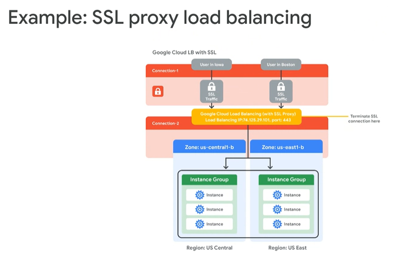

1. Instance Group = Gr. of VMs.
2. Load Balancer: Outside the VPC, Before the Ext. request hit the VMs, It goes to Load Balancer First.
- 

3. Cloud Armor WAF:
- Aloow/Deny the Traffic.
- Pay-as-you-go
- Integrate with SoC (Center Portal in GCLoud Sec.)

4. Colocation Feature: Connection b/w GC & On-prem Network devices.

5. Next-Gen Firewall:

6. Private GC access for Internal IP VMs:
- 

7.

8.

9.

10.